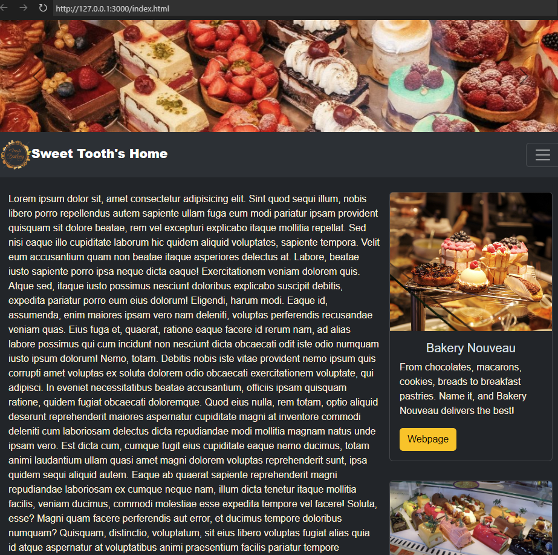
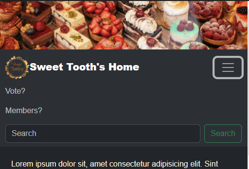
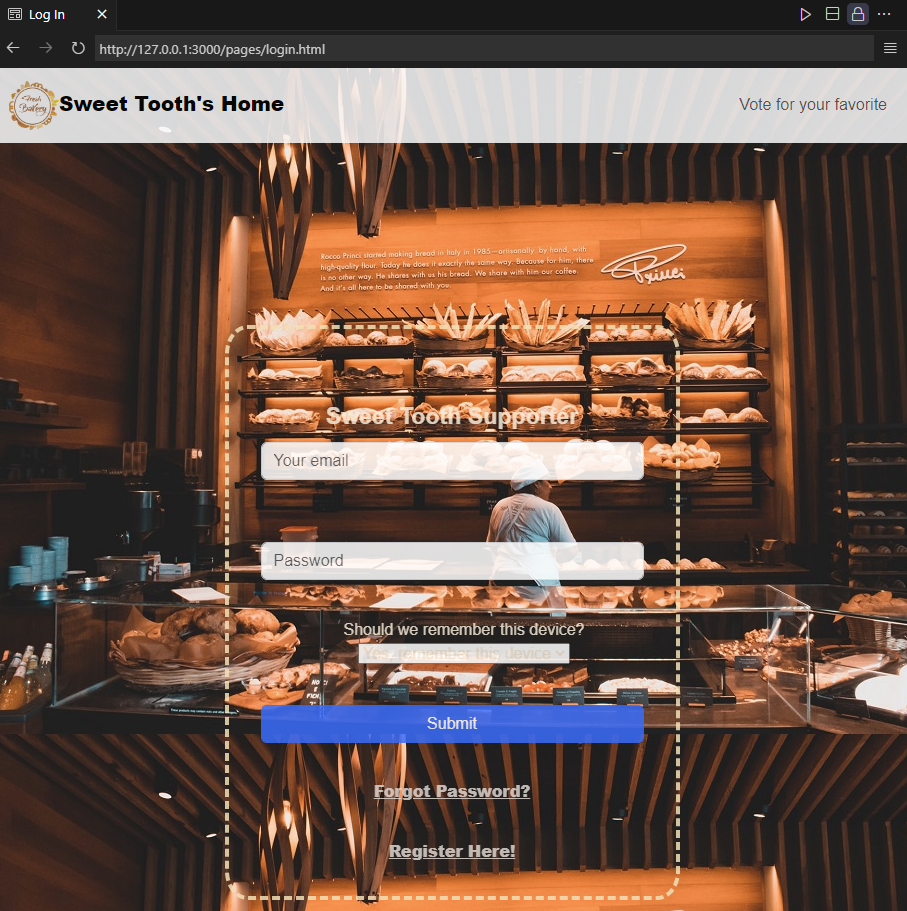
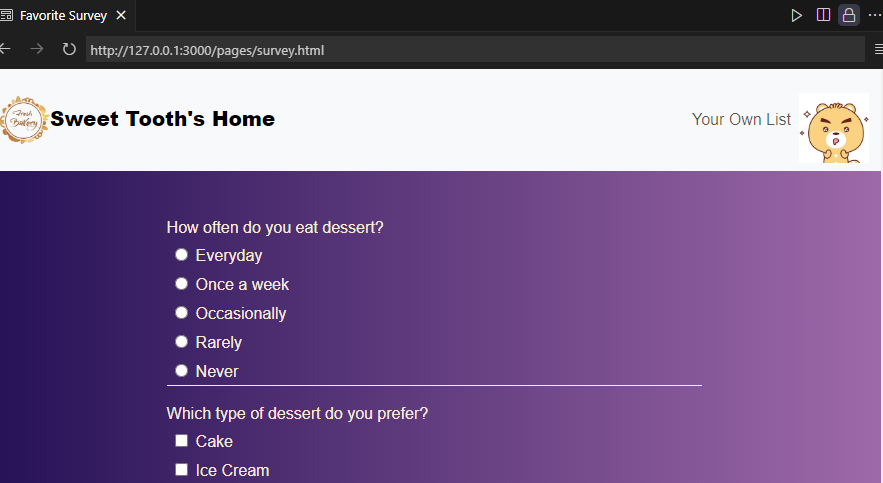

# SBA 307 HTML and CSS
## Per Scholas project about creating a simple website with a clean layout and styling

The main page is a practice of Bootstrap carrousel, nav bar, table and card. 
Main body content has used flex box and media for responsive design.  

I want to practice making the login in form and survey form, so my three pages are not in same layout. 

Future update:
1. Nav bar: 
* add dropdown logo for login
* replace search with question icon, then drop down
2. Bootstrap practice:
* learn how to add own CSS on bootstrap table, grid and button
3. Learn more about gif and iframe
4. I only used basic font. Maybe link some new font next time.

Source of [icons](https://iconmonstr.com/)

- Icons from [iconmonstr](https://iconmonstr.com/)
- Photos from [istockphoto](https://www.istockphoto.com/)
